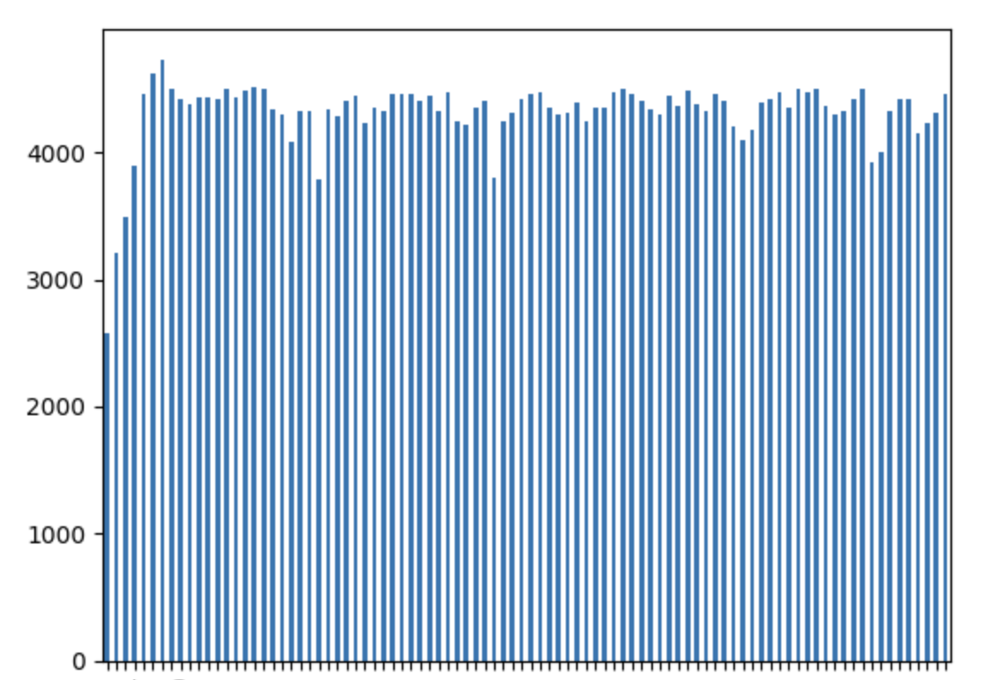
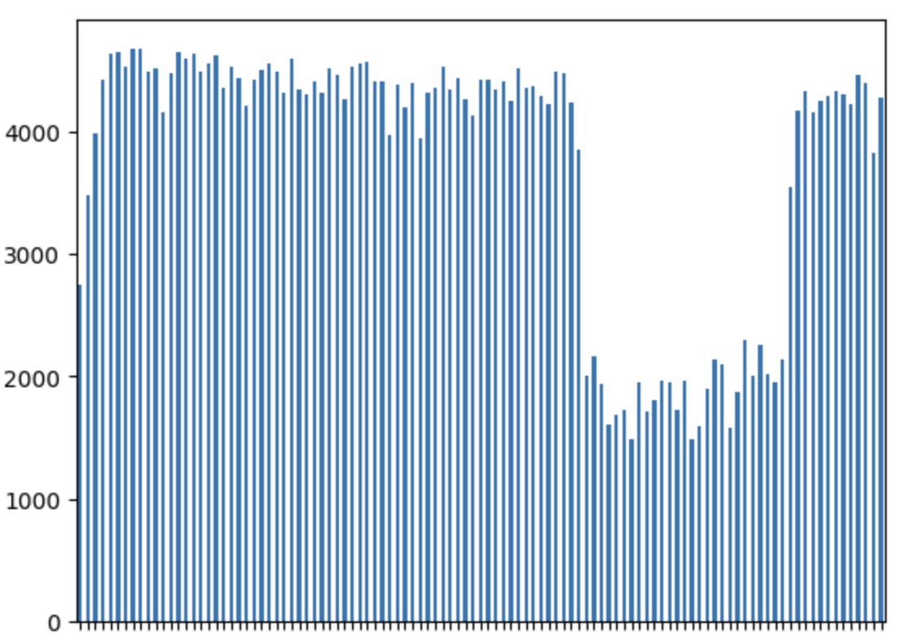
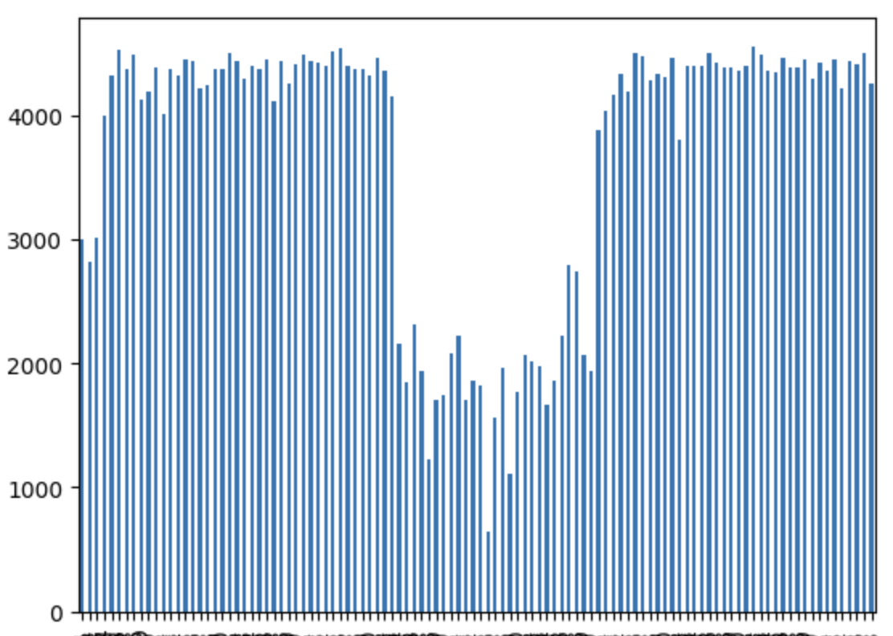

# RocksDB Test - interesting edge cases


## Setup

In first windows

```
root=# create table big_table(id int, fil1 text default md5(random()::text));
CREATE TABLE
Time: 71.316 ms
root=# insert into big_table(id) SELECT generate_series(1,10000000);
INSERT 0 10000000
Time: 72134.153 ms (01:12.134)
```

In second windows

```
pgbench -i -s 100
```


## pgrocks-happy-day-tps - constant 4K 

[pgrocks-happy-day-tps.log](pgrocks-happy-day-tps.log)



## pgrocks-drop-column-tps - dips to 2K

[pgrocks-drop-column-tps.log](pgrocks-drop-column-tps.log)


this was running fine, until about 5-10 seconds after running

```
root=# alter table big_table drop column fil1;
ALTER TABLE
Time: 15.719 ms
```

while this only took 15 ms to exec, shortly after running this command we see a major drop in thoughput.


## pgrocks-truncate-tps - dips to 2K

[pgrocks-truncate-tps.log](pgrocks-truncate-tps.log)


this was running fine, until about 5-10 seconds after running

```
root=# truncate table big_table;
TRUNCATE TABLE
Time: 75.829 ms
```

again while this only took 75 ms to exec, shortly after running this command we see a major drop in thoughput.