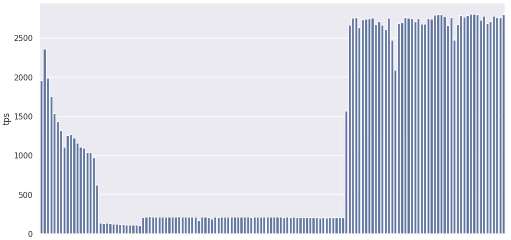

# Rocky Test - one VERY hot block


## Summary

The key points here
* The performance starts off good
* It rapidly falls off once we have a background long running transaction"
* When the "background long running transaction" completes this problem goes away





## Details 
NB This page is based off [rocky-lsm-tree-single-hot-row-problem.log](rocky-lsm-tree-single-hot-row-problem.log)


Simple and small pgbench dataset
```
postgres@6f5a3bbda7c2:~$ pgbench -i
dropping old tables...
creating tables...
generating data...
100000 of 100000 tuples (100%) done (elapsed 0.31 s, remaining 0.00 s)
vacuuming...
creating primary keys...
done.

```

one VERY hot block


```
postgres@6f5a3bbda7c2:~$ cat update-abalance-for-aid-1.sql
update pgbench_accounts set abalance=abalance+1 where aid = '1';
```

good performance initially but very rapidly falls away with a "long running transaction"

```
postgres@6f5a3bbda7c2:~$ pgbench -P 1 -c 10  -t 100000 -f update-abalance-for-aid-1.sql
starting vacuum...end.
progress: 1.0 s, 1960.0 tps, lat 4.193 ms stddev 5.261
progress: 2.0 s, 2359.9 tps, lat 4.237 ms stddev 2.854
progress: 3.0 s, 1990.0 tps, lat 5.023 ms stddev 3.093   << start begin; select txid_current();
progress: 4.0 s, 1754.9 tps, lat 5.690 ms stddev 3.493
progress: 5.0 s, 1535.1 tps, lat 6.512 ms stddev 3.934
progress: 6.0 s, 1434.0 tps, lat 6.968 ms stddev 3.627
progress: 7.0 s, 1318.9 tps, lat 7.576 ms stddev 4.021
progress: 8.0 s, 1108.1 tps, lat 9.003 ms stddev 6.025
progress: 9.0 s, 1254.0 tps, lat 7.982 ms stddev 4.094
progress: 10.0 s, 1266.0 tps, lat 7.893 ms stddev 3.670
progress: 11.0 s, 1226.0 tps, lat 8.140 ms stddev 3.626
progress: 12.0 s, 1160.0 tps, lat 8.622 ms stddev 3.865
progress: 13.0 s, 1111.9 tps, lat 8.984 ms stddev 4.156
progress: 14.0 s, 1097.1 tps, lat 9.091 ms stddev 4.326
progress: 15.0 s, 1042.0 tps, lat 9.611 ms stddev 4.507
progress: 16.0 s, 1039.0 tps, lat 9.627 ms stddev 4.384
progress: 17.0 s, 977.0 tps, lat 10.222 ms stddev 4.198
progress: 18.0 s, 626.9 tps, lat 15.019 ms stddev 18.176
progress: 19.0 s, 141.0 tps, lat 72.263 ms stddev 52.071
progress: 20.0 s, 132.0 tps, lat 75.583 ms stddev 53.645
progress: 21.0 s, 136.0 tps, lat 72.712 ms stddev 43.529
progress: 22.0 s, 131.0 tps, lat 75.043 ms stddev 58.413
progress: 23.0 s, 128.0 tps, lat 78.353 ms stddev 59.340
progress: 24.0 s, 125.0 tps, lat 81.775 ms stddev 54.357
progress: 25.0 s, 122.0 tps, lat 80.521 ms stddev 49.743
progress: 26.0 s, 118.0 tps, lat 84.333 ms stddev 62.069
progress: 27.0 s, 114.0 tps, lat 88.221 ms stddev 76.794
progress: 28.0 s, 114.0 tps, lat 87.940 ms stddev 72.510
progress: 29.0 s, 112.0 tps, lat 88.029 ms stddev 65.507
progress: 30.0 s, 111.0 tps, lat 90.993 ms stddev 77.388
progress: 31.0 s, 109.0 tps, lat 89.946 ms stddev 60.136
progress: 32.0 s, 208.0 tps, lat 50.996 ms stddev 41.272
progress: 33.0 s, 217.0 tps, lat 46.177 ms stddev 32.790
progress: 34.0 s, 219.0 tps, lat 45.190 ms stddev 27.221
progress: 35.0 s, 213.0 tps, lat 47.130 ms stddev 32.745
progress: 36.0 s, 217.0 tps, lat 45.927 ms stddev 30.013
progress: 37.0 s, 216.9 tps, lat 46.043 ms stddev 28.829
progress: 38.0 s, 216.0 tps, lat 46.475 ms stddev 31.077
progress: 39.0 s, 217.0 tps, lat 45.888 ms stddev 29.845
progress: 40.0 s, 218.0 tps, lat 45.773 ms stddev 28.694
progress: 41.0 s, 218.0 tps, lat 45.577 ms stddev 32.723
progress: 42.0 s, 214.0 tps, lat 47.473 ms stddev 36.373
progress: 43.0 s, 220.0 tps, lat 45.674 ms stddev 25.049
progress: 44.0 s, 217.0 tps, lat 45.069 ms stddev 30.754
progress: 45.0 s, 216.0 tps, lat 47.117 ms stddev 32.705
progress: 46.0 s, 218.0 tps, lat 46.098 ms stddev 34.003
progress: 47.0 s, 216.0 tps, lat 45.337 ms stddev 30.812
progress: 48.0 s, 215.0 tps, lat 47.071 ms stddev 32.223
progress: 49.0 s, 172.0 tps, lat 58.120 ms stddev 56.034
progress: 50.0 s, 216.0 tps, lat 46.035 ms stddev 33.292
progress: 51.0 s, 217.0 tps, lat 46.709 ms stddev 31.037
progress: 52.0 s, 207.0 tps, lat 48.066 ms stddev 34.050
progress: 53.0 s, 191.0 tps, lat 52.509 ms stddev 45.385
progress: 54.0 s, 215.0 tps, lat 45.525 ms stddev 29.697
progress: 55.0 s, 209.0 tps, lat 48.759 ms stddev 37.950
progress: 56.0 s, 214.0 tps, lat 46.630 ms stddev 28.486
progress: 57.0 s, 217.0 tps, lat 46.118 ms stddev 30.486
progress: 58.0 s, 215.0 tps, lat 45.728 ms stddev 27.670
progress: 59.0 s, 215.0 tps, lat 46.951 ms stddev 35.305
progress: 60.0 s, 216.0 tps, lat 46.471 ms stddev 29.680
progress: 61.0 s, 216.0 tps, lat 45.949 ms stddev 28.058
progress: 62.0 s, 214.0 tps, lat 47.050 ms stddev 31.476
progress: 63.0 s, 217.0 tps, lat 46.125 ms stddev 28.445
progress: 64.0 s, 217.0 tps, lat 46.057 ms stddev 28.887
progress: 65.0 s, 212.0 tps, lat 46.238 ms stddev 30.620
progress: 66.0 s, 215.0 tps, lat 46.853 ms stddev 33.393
progress: 67.0 s, 216.0 tps, lat 46.504 ms stddev 31.188
progress: 68.0 s, 216.0 tps, lat 46.645 ms stddev 31.374
progress: 69.0 s, 213.0 tps, lat 47.365 ms stddev 32.969
progress: 70.0 s, 217.0 tps, lat 45.830 ms stddev 30.689
progress: 71.0 s, 213.0 tps, lat 47.007 ms stddev 34.494
progress: 72.0 s, 216.0 tps, lat 46.392 ms stddev 30.324
progress: 73.0 s, 215.0 tps, lat 45.598 ms stddev 30.804
progress: 74.0 s, 216.0 tps, lat 47.075 ms stddev 31.167
progress: 75.0 s, 208.0 tps, lat 47.397 ms stddev 33.271
progress: 76.0 s, 214.0 tps, lat 47.040 ms stddev 29.516
progress: 77.0 s, 211.0 tps, lat 47.820 ms stddev 29.263
progress: 78.0 s, 214.0 tps, lat 46.174 ms stddev 27.435
progress: 79.0 s, 210.0 tps, lat 47.757 ms stddev 32.856
progress: 80.0 s, 212.0 tps, lat 46.279 ms stddev 32.586
progress: 81.0 s, 208.0 tps, lat 49.090 ms stddev 36.269
progress: 82.0 s, 211.0 tps, lat 46.602 ms stddev 35.023
progress: 83.0 s, 207.0 tps, lat 48.672 ms stddev 43.474
progress: 84.0 s, 210.0 tps, lat 48.046 ms stddev 37.698
progress: 85.0 s, 208.0 tps, lat 48.184 ms stddev 39.394
progress: 86.0 s, 205.0 tps, lat 48.742 ms stddev 35.636
progress: 87.0 s, 208.0 tps, lat 47.570 ms stddev 37.947
progress: 88.0 s, 206.0 tps, lat 48.178 ms stddev 36.765
progress: 89.0 s, 210.0 tps, lat 48.365 ms stddev 39.102
progress: 90.0 s, 209.0 tps, lat 47.069 ms stddev 36.979
progress: 91.0 s, 211.0 tps, lat 48.548 ms stddev 34.660
progress: 92.0 s, 212.0 tps, lat 46.574 ms stddev 31.500
progress: 93.0 s, 210.0 tps, lat 47.613 ms stddev 34.187    
progress: 94.0 s, 1567.0 tps, lat 6.607 ms stddev 17.480    << end;
progress: 95.0 s, 2668.8 tps, lat 3.747 ms stddev 2.988
progress: 96.0 s, 2758.1 tps, lat 3.622 ms stddev 2.821
progress: 97.0 s, 2761.0 tps, lat 3.620 ms stddev 2.819
progress: 98.0 s, 2635.1 tps, lat 3.789 ms stddev 3.094
progress: 99.0 s, 2735.9 tps, lat 3.657 ms stddev 2.810
progress: 100.0 s, 2740.0 tps, lat 3.647 ms stddev 2.858
progress: 101.0 s, 2748.1 tps, lat 3.636 ms stddev 2.783
progress: 102.0 s, 2757.9 tps, lat 3.625 ms stddev 2.802
progress: 103.0 s, 2674.1 tps, lat 3.738 ms stddev 3.024
progress: 104.0 s, 2714.0 tps, lat 3.672 ms stddev 2.910
progress: 105.0 s, 2663.7 tps, lat 3.762 ms stddev 2.960
progress: 106.0 s, 2605.9 tps, lat 3.834 ms stddev 3.145
progress: 107.0 s, 2754.2 tps, lat 3.629 ms stddev 2.782
progress: 108.0 s, 2473.9 tps, lat 4.042 ms stddev 3.973
progress: 109.0 s, 2094.1 tps, lat 4.772 ms stddev 10.836
progress: 110.0 s, 2686.9 tps, lat 3.723 ms stddev 2.900
progress: 111.0 s, 2697.3 tps, lat 3.700 ms stddev 2.833
progress: 112.0 s, 2761.0 tps, lat 3.619 ms stddev 2.808
progress: 113.0 s, 2753.1 tps, lat 3.633 ms stddev 2.730
progress: 114.0 s, 2749.8 tps, lat 3.632 ms stddev 2.761
progress: 115.0 s, 2713.2 tps, lat 3.686 ms stddev 2.956
progress: 116.0 s, 2746.8 tps, lat 3.637 ms stddev 2.959
progress: 117.0 s, 2678.0 tps, lat 3.732 ms stddev 3.096
progress: 118.0 s, 2681.1 tps, lat 3.727 ms stddev 3.034
progress: 119.0 s, 2752.0 tps, lat 3.633 ms stddev 2.710
progress: 120.0 s, 2741.9 tps, lat 3.645 ms stddev 2.778
progress: 121.0 s, 2796.0 tps, lat 3.575 ms stddev 2.781
progress: 122.0 s, 2802.0 tps, lat 3.566 ms stddev 2.783
progress: 123.0 s, 2801.9 tps, lat 3.566 ms stddev 2.748
progress: 124.0 s, 2774.1 tps, lat 3.602 ms stddev 2.863
progress: 125.0 s, 2661.0 tps, lat 3.758 ms stddev 2.909
progress: 126.0 s, 2764.2 tps, lat 3.615 ms stddev 2.766
progress: 127.0 s, 2473.9 tps, lat 4.028 ms stddev 4.121
progress: 128.0 s, 2671.8 tps, lat 3.753 ms stddev 2.911
progress: 129.0 s, 2785.1 tps, lat 3.584 ms stddev 2.715
progress: 130.0 s, 2765.9 tps, lat 3.615 ms stddev 2.713
progress: 131.0 s, 2788.0 tps, lat 3.586 ms stddev 2.795
progress: 132.0 s, 2806.3 tps, lat 3.564 ms stddev 2.697
progress: 133.0 s, 2807.9 tps, lat 3.558 ms stddev 2.687
progress: 134.0 s, 2797.9 tps, lat 3.570 ms stddev 2.829
progress: 135.0 s, 2732.8 tps, lat 3.658 ms stddev 2.849
progress: 136.0 s, 2784.2 tps, lat 3.589 ms stddev 2.742
progress: 137.0 s, 2687.2 tps, lat 3.722 ms stddev 3.001
progress: 138.0 s, 2712.1 tps, lat 3.683 ms stddev 2.983
progress: 139.0 s, 2782.7 tps, lat 3.593 ms stddev 2.759
progress: 140.0 s, 2764.1 tps, lat 3.617 ms stddev 2.817
progress: 141.0 s, 2763.8 tps, lat 3.614 ms stddev 2.814
progress: 142.0 s, 2799.2 tps, lat 3.572 ms stddev 2.741
```

and 
```
btree-lsm-demo % cat lsm-tree-single-hot-row-problem.log | grep progress | cut -f4 -d' ' | awk   '{print  NR ":" $1 ", " } ' | tr -d '\n'
1:1960.0, 2:2359.9, 3:1990.0, 4:1754.9, 5:1535.1, 6:1434.0, 7:1318.9, 8:1108.1, 9:1254.0, 10:1266.0, 11:1226.0, 12:1160.0, 13:1111.9, 14:1097.1, 15:1042.0, 16:1039.0, 17:977.0, 18:626.9, 19:141.0, 20:132.0, 21:136.0, 22:131.0, 23:128.0, 24:125.0, 25:122.0, 26:118.0, 27:114.0, 28:114.0, 29:112.0, 30:111.0, 31:109.0, 32:208.0, 33:217.0, 34:219.0, 35:213.0, 36:217.0, 37:216.9, 38:216.0, 39:217.0, 40:218.0, 41:218.0, 42:214.0, 43:220.0, 44:217.0, 45:216.0, 46:218.0, 47:216.0, 48:215.0, 49:172.0, 50:216.0, 51:217.0, 52:207.0, 53:191.0, 54:215.0, 55:209.0, 56:214.0, 57:217.0, 58:215.0, 59:215.0, 60:216.0, 61:216.0, 62:214.0, 63:217.0, 64:217.0, 65:212.0, 66:215.0, 67:216.0, 68:216.0, 69:213.0, 70:217.0, 71:213.0, 72:216.0, 73:215.0, 74:216.0, 75:208.0, 76:214.0, 77:211.0, 78:214.0, 79:210.0, 80:212.0, 81:208.0, 82:211.0, 83:207.0, 84:210.0, 85:208.0, 86:205.0, 87:208.0, 88:206.0, 89:210.0, 90:209.0, 91:211.0, 92:212.0, 93:210.0, 94:1567.0, 95:2668.8, 96:2758.1, 97:2761.0, 98:2635.1, 99:2735.9, 100:2740.0, 101:2748.1, 102:2757.9, 103:2674.1, 104:2714.0, 105:2663.7, 106:2605.9, 107:2754.2, 108:2473.9, 109:2094.1, 110:2686.9, 111:2697.3, 112:2761.0, 113:2753.1, 114:2749.8, 115:2713.2, 116:2746.8, 117:2678.0, 118:2681.1, 119:2752.0, 120:2741.9, 121:2796.0, 122:2802.0, 123:2801.9, 124:2774.1, 125:2661.0, 126:2764.2, 127:2473.9, 128:2671.8, 129:2785.1, 130:2765.9, 131:2788.0, 132:2806.3, 133:2807.9, 134:2797.9, 135:2732.8, 136:2784.2, 137:2687.2, 138:2712.1, 139:2782.7, 140:2764.1, 141:2763.8, 142:2799.2
```

i.e. cut and paste inot

```
import pandas as pd
import matplotlib.pyplot as plt
import seaborn as sns
s = pd.Series({1:1960.0, 2:2359.9, 3:1990.0, 4:1754.9, 5:1535.1, 6:1434.0, 7:1318.9, 8:1108.1, 9:1254.0, 10:1266.0, 11:1226.0, 12:1160.0, 13:1111.9, 14:1097.1, 15:1042.0, 16:1039.0, 17:977.0, 18:626.9, 19:141.0, 20:132.0, 21:136.0, 22:131.0, 23:128.0, 24:125.0, 25:122.0, 26:118.0, 27:114.0, 28:114.0, 29:112.0, 30:111.0, 31:109.0, 32:208.0, 33:217.0, 34:219.0, 35:213.0, 36:217.0, 37:216.9, 38:216.0, 39:217.0, 40:218.0, 41:218.0, 42:214.0, 43:220.0, 44:217.0, 45:216.0, 46:218.0, 47:216.0, 48:215.0, 49:172.0, 50:216.0, 51:217.0, 52:207.0, 53:191.0, 54:215.0, 55:209.0, 56:214.0, 57:217.0, 58:215.0, 59:215.0, 60:216.0, 61:216.0, 62:214.0, 63:217.0, 64:217.0, 65:212.0, 66:215.0, 67:216.0, 68:216.0, 69:213.0, 70:217.0, 71:213.0, 72:216.0, 73:215.0, 74:216.0, 75:208.0, 76:214.0, 77:211.0, 78:214.0, 79:210.0, 80:212.0, 81:208.0, 82:211.0, 83:207.0, 84:210.0, 85:208.0, 86:205.0, 87:208.0, 88:206.0, 89:210.0, 90:209.0, 91:211.0, 92:212.0, 93:210.0, 94:1567.0, 95:2668.8, 96:2758.1, 97:2761.0, 98:2635.1, 99:2735.9, 100:2740.0, 101:2748.1, 102:2757.9, 103:2674.1, 104:2714.0, 105:2663.7, 106:2605.9, 107:2754.2, 108:2473.9, 109:2094.1, 110:2686.9, 111:2697.3, 112:2761.0, 113:2753.1, 114:2749.8, 115:2713.2, 116:2746.8, 117:2678.0, 118:2681.1, 119:2752.0, 120:2741.9, 121:2796.0, 122:2802.0, 123:2801.9, 124:2774.1, 125:2661.0, 126:2764.2, 127:2473.9, 128:2671.8, 129:2785.1, 130:2765.9, 131:2788.0, 132:2806.3, 133:2807.9, 134:2797.9, 135:2732.8, 136:2784.2, 137:2687.2, 138:2712.1, 139:2782.7, 140:2764.1, 141:2763.8, 142:2799.2},
               name='tps')
sns.set_theme(rc={'figure.figsize': (12, 6)})
sns.barplot(s)
```

