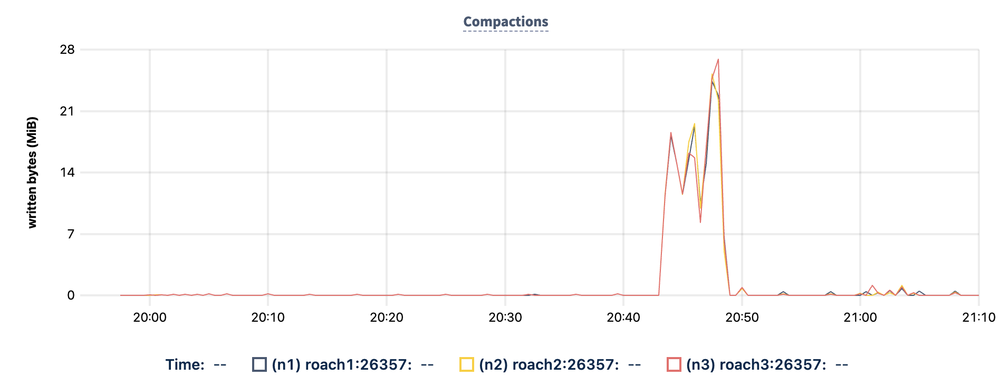
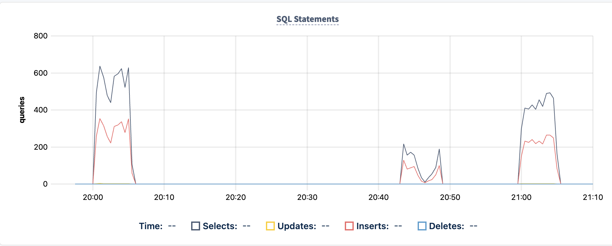
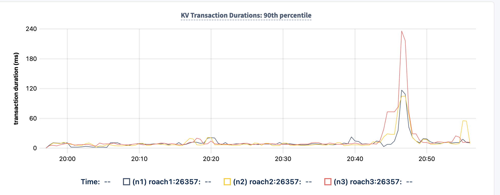

# [CockroachDB Test - Very big transaction - compaction spike


Test script was 
```
create table big_table(id int,filler varchar(100) default '0123456789012345678901234567890123456789012345678901234567890123456789012345678901234567890123456789');
create index big_table_id on big_table(id);
\d big_table
insert into big_table(id) SELECT generate_series(1,100000);
analyze big_table;
explain analyze select filler from big_table where id = 80000;
insert into big_table(id) SELECT generate_series(1,1000000);
analyze big_table;
explain analyze select filler from big_table where id = 80000;
insert into big_table(id) SELECT generate_series(1,10000000);
analyze big_table;
explain analyze select filler from big_table where id = 80000;
insert into big_table(id) SELECT generate_series(1,100000000);
```

Eventually above triggers compaction spike



and we can see pgbench throughput affects i.e. throughput of 2nd run dramatically down (even on 3rd run oa full 10 mins later not fully recovered)



also we can see underlying KV latency spikes



As per Mark Callaghan FOSDEM presentation (2017 and introduced Rocks DB to me):

> Limiting max rows/memory for large transactions … RocksDB was originally designed for small transactions
