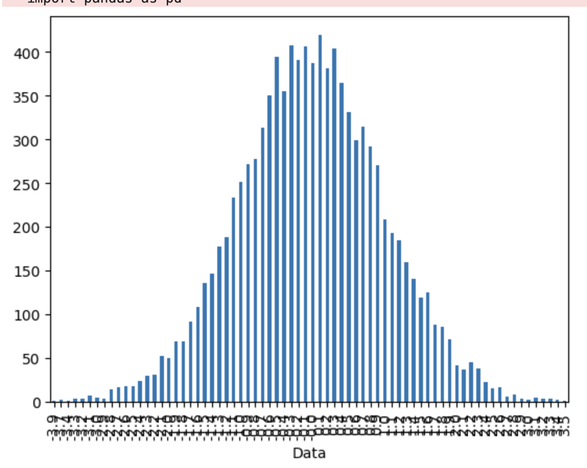
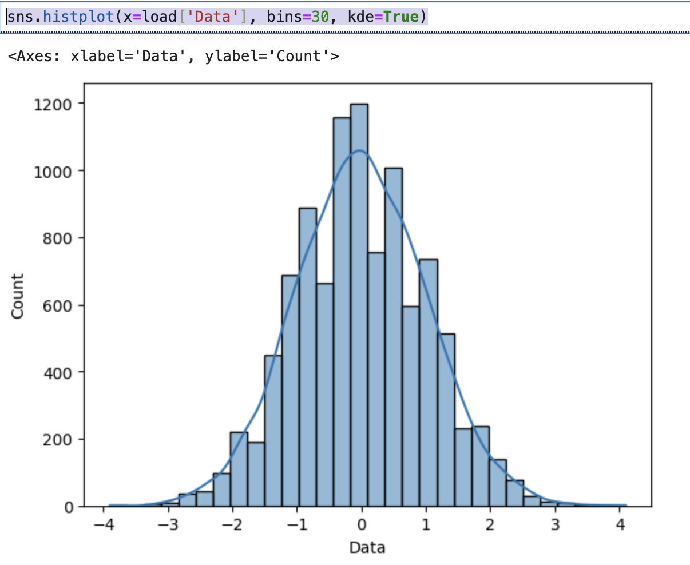

#  Setup jupyter notebooks via docker

Following this ["official docker.com " blog post for juptier](https://www.docker.com/blog/supercharging-ai-ml-development-with-jupyterlab-and-docker/) 

```
davidpitts@Davids-MacBook-Pro ~ % docker container run -it --rm -p 10000:8888 jupyter/base-notebook
Unable to find image 'jupyter/base-notebook:latest' locally
latest: Pulling from jupyter/base-notebook
895d322e8e59: Pull complete
...
[I 2024-01-27 04:12:08.581 ServerApp] Serving notebooks from local directory: /home/jovyan
[I 2024-01-27 04:12:08.581 ServerApp] Jupyter Server 2.8.0 is running at:
[I 2024-01-27 04:12:08.581 ServerApp] http://967312bf81fb:8888/lab?token=e577cae688c961b0a12c9c3ddebe6fe8c06a77f24f4bdf26
[I 2024-01-27 04:12:08.581 ServerApp]     http://127.0.0.1:8888/lab?token=e577cae688c961b0a12c9c3ddebe6fe8c06a77f24f4bdf26
[I 2024-01-27 04:12:08.581 ServerApp] Use Control-C to stop this server and shut down all kernels (twice to skip confirmation).
[C 2024-01-27 04:12:08.583 ServerApp]

    To access the server, open this file in a browser:
        file:///home/jovyan/.local/share/jupyter/runtime/jpserver-7-open.html
    Or copy and paste one of these URLs:
        http://967312bf81fb:8888/lab?token=e577cae688c961b0a12c9c3ddebe6fe8c06a77f24f4bdf26
 ...
 ```

 note:
 * The token above is dynamically generated each rum
 * you also need `install matplotlib` i.e. this regular `import matplotlib.pyplot as plt` command fails

```
 ---------------------------------------------------------------------------
ModuleNotFoundError                       Traceback (most recent call last)
Cell In[3], line 1
----> 1 import matplotlib.pyplot as plt

ModuleNotFoundError: No module named 'matplotlib'
```
the solution is to run (again from within jupyter notebook)
```
!pip install matplotlib scikit-learn pandas
```
more [details in the original blog post](https://www.docker.com/blog/supercharging-ai-ml-development-with-jupyterlab-and-docker/)


 
and a [simple barchat demo](https://stackoverflow.com/questions/67755912/barchart-plot-and-display-issue-in-jupyter-notebook-when-using-matplotlib)

 ```
import matplotlib.pyplot as plt
import pandas as pd
import numpy as np

load = pd.DataFrame({'Data': np.random.normal(0, 1, 10000).round(1)})
r = load['Data'].value_counts().sort_index()
r.plot(kind='bar')
plt.show()
```

gives:




and

```
import seaborn as sns
sns.histplot(x=load['Data'], bins=30, kde=True)
```





