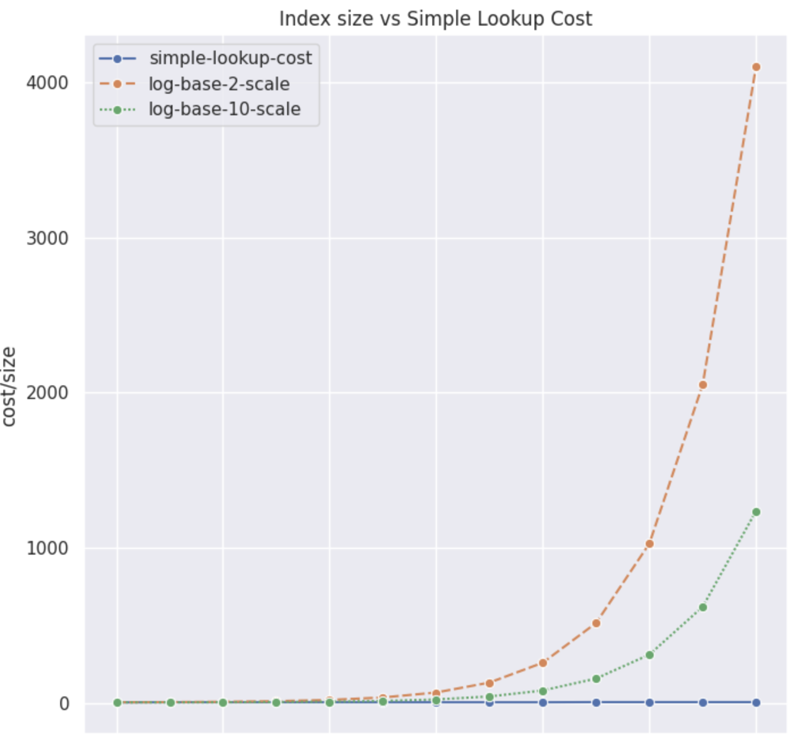

# Seaborn Exploring btree index efficienc

From within my jupyter notebook:
```
import seaborn as sns
sns.set_theme(style="darkgrid")
import matplotlib.pyplot as plt
import numpy as np
import pandas as pd

d = { 'simple-lookup-cost': [   3,   4,    4,    4,    4,    4,     4,     4,     4,   5,     5,        5   ], 
       'log-base-2-scale':  [3.00, 4.00, 5.00, 6.00, 7.00, 8.00, 9.00,  10.00, 11.00, 12.00, 13.00, 14.00],
       'log-base-10-scale': [3.00, 3.30, 3.60, 3.90, 4.20, 4.51, 4.81,  5.11,  5.41,  5.71, 6.01, 6.31]
} 

df = pd.DataFrame(data=d)
plt.figure(figsize=(8,8)) # Width and Height of the chart
sns.lineplot(             data=df,
             marker='o', # Style used to mark the join between 2 points
            )
plt.xlabel('scale-factor (to the power of 2)') # x-axis name
plt.ylabel('order-of-cost ') # y-axis name
plt.title('Exploring index efficiency') # Add a title
plt.show() # Display the graph~
```


generates



