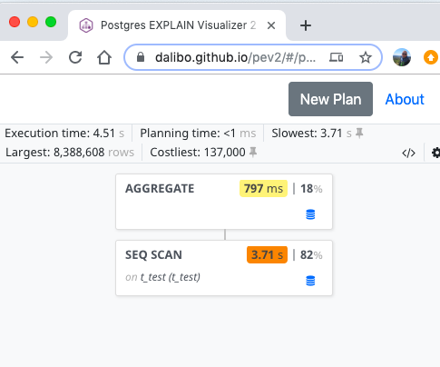

## Step 01 rerun with pev2 graphical version of the execution plan 

Firstly you need to run psql with some special options

```
~ $  psql -qAt -d milano2019
milano2019=#
```

firstly let rerun the regular plan 
```
milano2019=# explain (analyze)  select count(*) from t_test;
Aggregate  (cost=158288.60..158288.61 rows=1 width=8) (actual time=4764.453..4764.453 rows=1 loops=1)
  ->  Seq Scan on t_test  (cost=0.00..137317.08 rows=8388608 width=0) (actual time=2.538..4016.553 rows=8388608 loops=1)
Planning Time: 1.814 ms
Execution Time: 4764.577 ms
```

and now in json format

```
milano2019=# explain (analyze, format json)  select count(*) from t_test;
[
  {
    "Plan": {
      "Node Type": "Aggregate",
      "Strategy": "Plain",
      "Partial Mode": "Simple",
      "Parallel Aware": false,
      "Startup Cost": 158288.60,
      "Total Cost": 158288.61,
      "Plan Rows": 1,
      "Plan Width": 8,
      "Actual Startup Time": 4511.241,
      "Actual Total Time": 4511.241,
      "Actual Rows": 1,
      "Actual Loops": 1,
      "Plans": [
        {
          "Node Type": "Seq Scan",
          "Parent Relationship": "Outer",
          "Parallel Aware": false,
          "Relation Name": "t_test",
          "Alias": "t_test",
          "Startup Cost": 0.00,
          "Total Cost": 137317.08,
          "Plan Rows": 8388608,
          "Plan Width": 0,
          "Actual Startup Time": 0.037,
          "Actual Total Time": 3714.727,
          "Actual Rows": 8388608,
          "Actual Loops": 1
        }
      ]
    },
    "Planning Time": 0.070,
    "Triggers": [
    ],
    "Execution Time": 4511.265
  }
]
```

which you can graph this using pev2 with 

* locally hosted version i.e. npm install pev2
* remotely hosted version i.e. https://dalibo.github.io/pev2/#/plan





